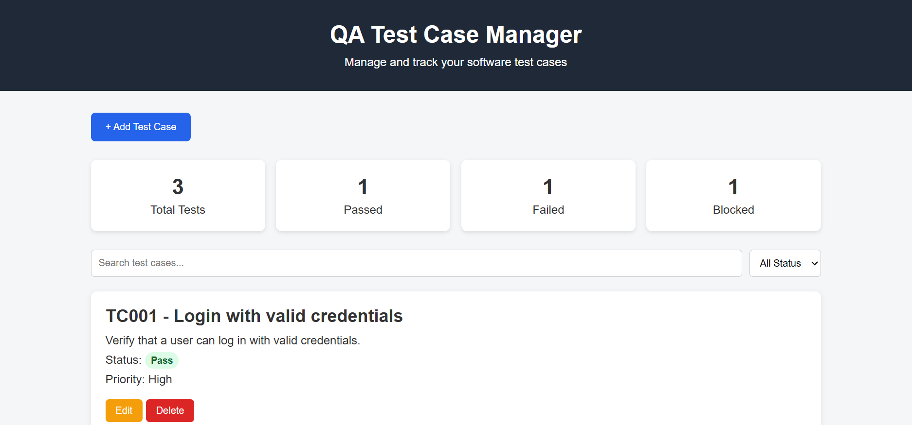
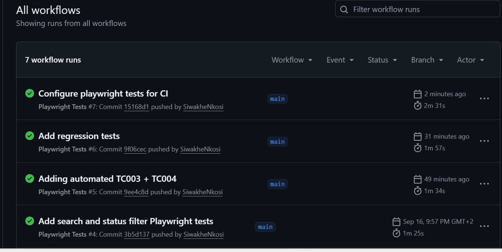

# QA Test Case Manager

A web-based **QA Test Case Management application** built to demonstrate my practical skills in **software testing, JavaScript, Playwright automation, Git/GitHub, and CI/CD**.

The application allows users to create and manage test cases while also serving as a project where I can practice both **manual testing and automated end-to-end testing**.

## Live Demo

[Open the QA Test Case Manager](https://siwakhenkosi.github.io/qa-test-manager/)

## Application Preview

## Project Purpose

I created this project as part of my journey into **Software Testing and QA Automation**.

The goal of the project is to demonstrate my ability to:

- Design and document test cases
- Perform functional testing
- Identify and document defects
- Build automated tests using Playwright
- Work with JavaScript and DOM elements
- Use Git and GitHub for version control
- Run automated tests through GitHub Actions
- Understand the relationship between manual and automated testing

## Features

The QA Test Case Manager allows users to:

- Add new test cases
- Edit existing test cases
- Delete test cases
- Assign test case statuses
- Assign priorities
- Search for test cases
- Filter test cases by status
- View test case statistics
- Store test cases using browser Local Storage

## Testing

The application is tested using a combination of **manual testing and automated testing**.

### Test Documentation

Manual test cases and defect reports are maintained in the repository:

- `tests/manual-test-cases.md` — Manual functional and regression test cases
- `tests/bug-reports.md` — Defects identified during testing
- `e2e/qa-test-manager.spec.js` — Playwright automated test suite

### Manual Testing

Manual test cases are created to verify the functionality of the application.

Testing includes areas such as:

- Creating test cases
- Editing test cases
- Deleting test cases
- Searching for test cases
- Filtering test cases
- Combining search and filter functionality
- Test case status handling
- Test case statistics
- Input validation

During manual testing, defects are documented with:

- Test Case ID
- Feature
- Preconditions
- Test Steps
- Expected Result
- Actual Result
- Test Status

## Automation Testing

Automated end-to-end tests are implemented using **Playwright**.

The automated test suite currently covers key application functionality including:

- Adding a new test case
- Editing an existing test case
- Deleting a test case
- Searching for test cases
- Filtering test cases by status
- Combining search and status filters
- Regression testing for previously identified defects

The automated tests run across multiple Playwright browser projects.

The test suite currently completes successfully with **18 passing test executions** across the configured browsers.

### Regression Testing

A regression test was created for **BUG-001**, which was originally discovered during manual testing.

The defect involved the search and status filters not being applied together correctly.

The defect was:

1. Identified through manual testing
2. Documented in a bug report
3. Fixed in the application code
4. Manually retested
5. Automated using Playwright to prevent regression

This demonstrates the complete testing lifecycle from defect discovery to automated regression coverage.

## Continuous Integration

The project uses **GitHub Actions** to automatically run Playwright tests.

When changes are pushed to the repository, the CI workflow automatically:

1. Set up the testing environment
2. Install project dependencies
3. Install Playwright browsers
4. Start the application
5. Execute automated tests
6. Report whether the tests passed or failed

This provides practical experience with automated testing in a CI/CD environment.

The GitHub Actions workflow is currently passing successfully, confirming that the automated test suite can run independently in a CI environment.

#### CI Test Results

The Playwright test suite runs automatically through GitHub Actions when changes are pushed to the repository.

# Technologies Used

- **HTML** — Application structure
- **CSS** — Application styling
- **JavaScript** — Application functionality
- **Local Storage** — Persistent browser-based test case storage
- **Playwright** — End-to-end test automation
- **Node.js / npm** — Dependency and script management
- **Git** — Version control
- **GitHub** — Source code management
- **GitHub Actions** — Continuous Integration

## Defect Management

Defects discovered during testing are investigated and documented.

A typical defect report contains:

- Bug/Test Case ID
- Feature affected
- Preconditions
- Steps to reproduce
- Expected result
- Actual result
- Status

When a defect is fixed, the affected functionality is retested to verify the fix and check for regressions.

## What I Learned

Through this project, I have gained practical experience with:

- Translating requirements into test scenarios
- Designing positive and negative test cases
- Performing functional testing
- Investigating unexpected application behaviour
- Documenting software defects
- Understanding DOM elements and selectors
- Writing Playwright automated tests
- Debugging failed automated tests
- Working with Git branches, commits and pushes
- Using GitHub for source control
- Running automated tests in GitHub Actions
- Understanding how testing fits into a development workflow

## Future Improvements

Planned improvements include:

- Increase Playwright automation coverage
- Add additional negative and edge-case scenarios
- Improve input validation
- Improve automated test reporting
- Add screenshots and testing evidence to the repository
- Deploy a live version of the application
- Refactor automated tests using reusable helper functions or Page Object Model concepts

## About Me

**Siwakhe Nkosi**

ISTQB-certified software tester developing practical experience in **manual testing and test automation**.

My current focus is strengthening my automation testing skills using **JavaScript and Playwright**, while building real projects that demonstrate the complete QA process from test design and defect identification to automated regression testing and CI/CD.

## Repository

GitHub: SiwakheNkosi/qa-test-manager
